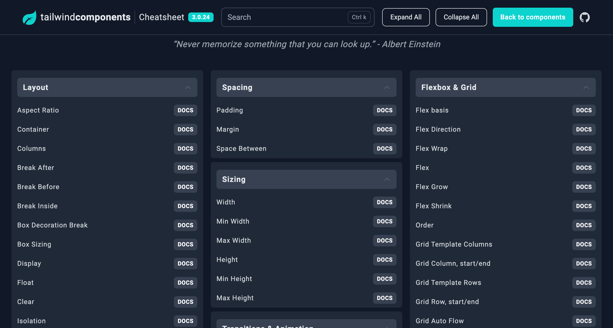
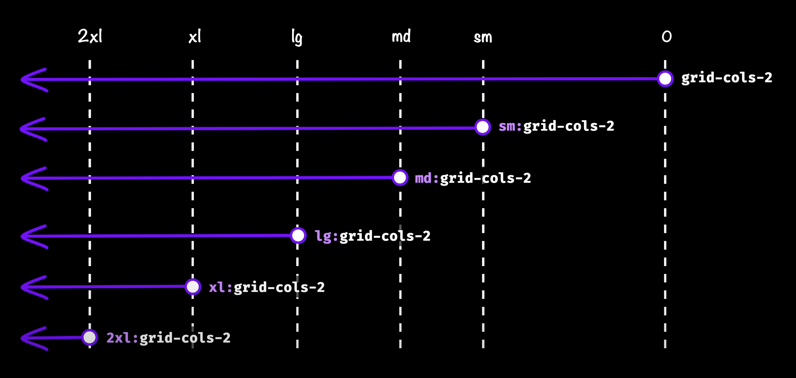

# Tailwind CSS 的最佳实践

## Table of Content
- [Learn Tailwind](#learn-tailwind)
- [Tailwind Cheat Sheet](#tailwind-cheat-sheet)
- [Tailwind VS Code 插件](#tailwind-vs-code-插件)
- [格式化 Tailwind CSS 代码](#格式化-tailwind-css-代码)
- [Tailwind Responsive Design](#tailwind-responsive-design)
  - [Range](#range)
  - [自定义媒体查询范围](#自定义媒体查询范围)
- [额外的 CSS 写在哪里](#额外的-css-写在哪里)
  - [Layer](#layer)
  - [在 CSS 文件中使用 Tailwind](#在-css-文件中使用-tailwind)
- [Tailwind Tricks](#tailwind-tricks)
  - [Peer and Group](#peer-and-group)
  - [Animation](#animation)
- [Reference](#reference)

## Learn Tailwind
打开 Youtube 或 Udemy 搜索 Tailwind 的教程，可以看到这些视频动辄就是3至7个小时不等，但这样学习 Tailwind 是一件很浪费时间的事。Tailwind 本质上还是 CSS，在 CSS 的基础上添加了类名以供使用，所以掌握了 CSS 基本就掌握了 Tailwind。

在阅读了[Tailwind 的文档](https://tailwindcss.com/docs/installation)中的 Core Concepts 之后，就可以直接上手练习项目了，想写什么属性就在文档里查阅，可以用 Tailwind 重写自己以前用 CSS 做的项目，或自己新建一些组件，就这样一直练习直到熟练。

善用文档，多做项目，不要看浪费时间的教程，这才是最好的学习 Tailwind 的方式。

## Tailwind Cheat Sheet

Tailwind 中有很多预先构建（pre-built）的类名（class），但我不需要记住它们所有的名字，除了用官方文档查阅，还可以直接用速查表（Cheat Sheet）查找 CSS 属性相关的类名。

推荐的 Tailwind Cheat Sheet：[Tailwind Components](https://tailwindcomponents.com/cheatsheet/)



## Tailwind VS Code 插件

在 VS Code 插件库中搜索并安装由 **Tailwind Labs** 创建的 `Tailwind CSS IntelliSense`。

这个插件可以：
1. 在你编写类名时智能提示类名可能的值
2. 在你把鼠标悬浮到某个 Tailwind 类名上时让你预览这个类名里实际的 CSS 代码。

## 格式化 Tailwind CSS 代码

在项目中安装 Prettier for Tailwind，这个插件会自动把 Tailwind 类名按照官方推荐的顺序排序。
```bash
npm install -D prettier prettier-plugin-tailwindcss
```

## Tailwind Responsive Design

Tailwind 的响应式设计原则是 Mobile First，也就是先按照移动端的大小做页面，再根据页面一点点放大后调整元素的布局和大小。



### Range
Tailwind 中媒体查询的范围怎么写：
```HTML
<div sm:max-md:grid-cols-3></div>
```

### 自定义媒体查询范围
```javascript
// taiwind.config.js

/** @type {import('tailwindcss').Config} */
module.exports = {
  theme: {
    screens: {
      'sm': '640px',
      // => @media (min-width: 640px) { ... }

      'md': '768px',
      // => @media (min-width: 768px) { ... }

      'lg': '1024px',
      // => @media (min-width: 1024px) { ... }

      'xl': '1280px',
      // => @media (min-width: 1280px) { ... }

      '2xl': '1536px',
      // => @media (min-width: 1536px) { ... }
    }
  }
}
```

## 额外的 CSS 写在哪里
通常写 CSS 时，会在一个文件中重置或设置元素的一些基本样式，比如
```css
* {
  padding: 0;
  margin: 0;
  box-sizing: 0;
}

body {
  font-family: "Times New Roman", Times, serif;
}
```
像这样的用于重置样式或设置基本样式的 CSS 代码，在项目使用了 Tailwind 的情况下，可以写在`index.css`。

### Layer

Tailwind 有3个layer，`base`，`components`和`utilities`，指定了 layer 之后，用 CSS 编写即可。
- 添加元素的样式（如`h2`），用`base` layer。
- 添加组件的样式（如卡片、按钮），用`compnents` layer
- 添加 Tailwind 没有提供的 CSS feature，用`utilies` layer
  
```css
/* 修改 layer 样例，定义了类名之后直接在 HTML 元素上使用 */
/* index.css */

@layer components {
  .card [
    display: place;
    align-items: center;
    justify-contents: center;
    max-width: 300px;
    height: 100px;
    background-color: #f1f1f1;
  ]
}
```

### 在 CSS 文件中使用 Tailwind
用`@apply`在 CSS 文件中使用 Tailwind。
```css
/* index.css */

@layer components {
  .card [
    @apply flex items-center justify-center;
    max-width: 300px;
    height: 100px;
    background-color: #f1f1f1;
  ]
}
```

## Tailwind Tricks

### Peer and Group
1. 当鼠标悬浮到父元素时，子元素样式发生改变。

```HTML
<div class="group hover:bg-purple-600">
  <div class="group-hover:bg-red-600"></div>
  <div class="group-hover:bg-blue-600"></div>
</div>
```

2. 当鼠标悬停到某一元素时，其兄弟元素样式发生改变。
```HTML
<div class="peer hover:bg-purple-600"></div>
<div class="peer-hover:bg-green-600"></div>
```

3. 如果想对每个子元素或兄弟元素区别对待，也可以给 group 或 peer 添加不同的名字。
```HTML
<div class="group/name hover:bg-purple-600">
  <div class="group-hover/name:bg-red-600"></div>
  <div class="group-hover/name:bg-blue-600"></div>
</div>

<div class="peer/other-name hover:bg-purple-600"></div>
<div class="peer-hover/other-name:bg-green-600"></div>
```

### Animation
Tailwind 有一些好用的自带的 Animation 类名。
```HTML
<div class="animate-spin"></div>
<div class="animate-ping"></div>
<div class="animate-pulse"></div>
<div class="animate-bounce"></div>
```

## Reference
1. [Tailwind CSS Tutorial for Beginners (2023) – What YOU need to know](https://youtu.be/DenUCuq4G04?si=rLdbZB0A1jDQU9iT)
2. [10 Tailwind Tricks You NEED To Know!](https://www.youtube.com/watch?v=aSlK3GhRuXA&ab_channel=Ravi-PerfectBase)
